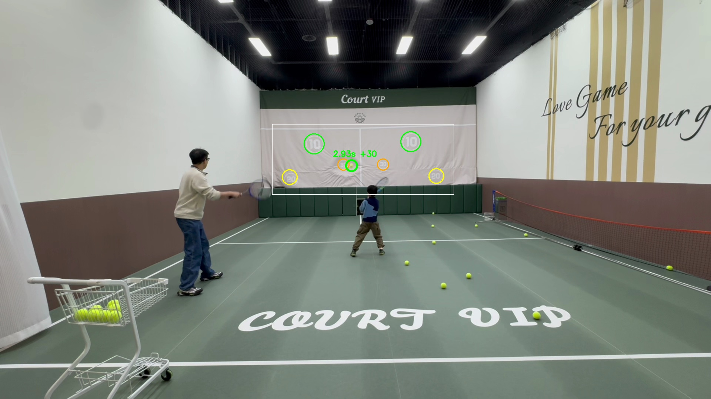
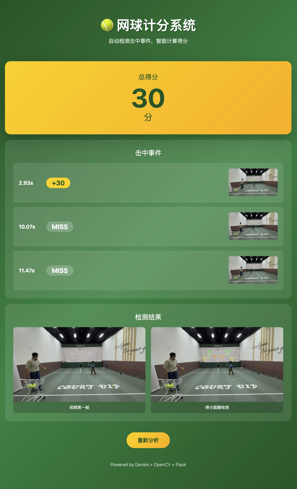

# Tennis Score - 网球自动计分系统

基于计算机视觉的网球练习计分系统，能够自动识别网球击中幕布的位置并计算得分。



## 效果演示

### Web 界面



系统会自动检测视频中的击中事件，实时显示得分

### 测试视频

📹 **[点击查看测试视频 (hit.mov)](hit.mov)**

## 功能特点

- **智能圆圈检测**: 使用 Gemini AI 进行粗定位 + 固定半径精确定位
- **击中检测**: 帧差法检测幕布震动 + HSV 颜色识别球体位置
- **实时计分**: 自动判断击中区域并累加分数
- **Web 界面**: 支持视频上传和实时结果展示

## 技术架构


### 核心算法

1. **圆圈检测** (`detect_circles_final.py`)
   - 裁剪幕布区域并放大 2 倍
   - 调用 Gemini API 识别数字位置
   - 根据分值分配固定半径 (10分→27px, 20分→20px, 30分→15px)

2. **击中检测** (`detect_hit_score.py`)
   - 帧差法检测幕布区域的运动
   - 动态阈值 (mean + 1.5×std) 识别击中时刻
   - HSV 颜色空间定位黄绿色球体
   - 1.5 秒冷却防止重复计分

## 安装

```bash
# 克隆项目
git clone https://github.com/xychendave/TennisScore-AI.git
cd TennisScore-AI

# 安装依赖
pip install -r requirements.txt

# 设置 Gemini API Key (必须)
export GEMINI_API_KEY="your-api-key"
```

### 获取 Gemini API Key

1. 访问 [Google AI Studio](https://aistudio.google.com/apikey)
2. 登录 Google 账号
3. 点击 "Create API Key" 创建新的 API Key
4. 复制生成的 Key，设置环境变量：

```bash
# macOS/Linux - 临时设置（当前终端有效）
export GEMINI_API_KEY="你的API Key"

# macOS/Linux - 永久设置（添加到 ~/.bashrc 或 ~/.zshrc）
echo 'export GEMINI_API_KEY="你的API Key"' >> ~/.zshrc
source ~/.zshrc

# Windows PowerShell
$env:GEMINI_API_KEY="你的API Key"

# Windows CMD
set GEMINI_API_KEY=你的API Key
```

## 使用方法

### 命令行模式

```bash
python tennis_scorer.py --video hit.mov
```

### Web 界面

```bash
python app.py
# 访问 http://localhost:5001
```

## 项目结构

```
tennis_score/
├── app.py                    # Flask Web 后端
├── detect_circles_final.py   # 圆圈检测算法
├── detect_hit_score.py       # 击中检测与计分
├── tennis_scorer.py          # 主程序入口
├── templates/
│   └── index.html            # Web 前端页面
├── docs/
│   ├── circle_detection_algorithm.md
│   └── hit_detection_algorithm.md
├── demand.md                 # 需求文档
├── requirements.txt          # 依赖列表
└── README.md
```

## 配置参数

| 参数 | 默认值 | 说明 |
|------|--------|------|
| COOLDOWN_SEC | 1.5 | 击中冷却时间 (秒) |
| MOTION_THRESHOLD_FACTOR | 1.5 | 运动检测阈值系数 |
| HIT_TOLERANCE | 15 | 得分区域容差 (像素) |

## 环境要求

- Python 3.8+
- OpenCV 4.5+
- Gemini API Key

## License

MIT License
